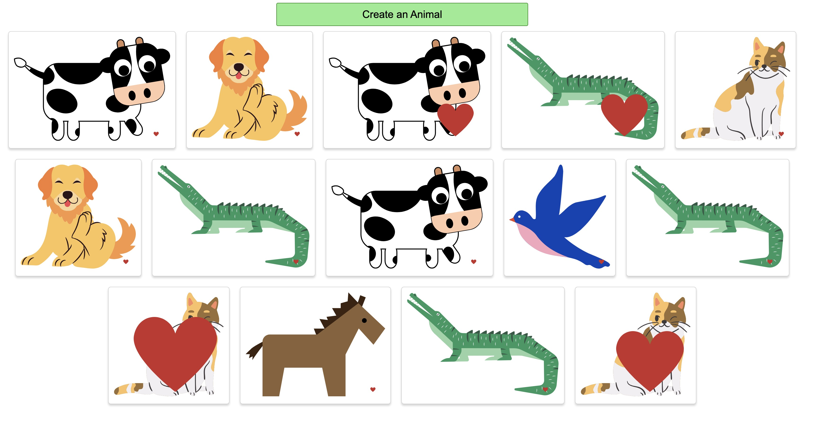

# React_Animal_Liker

Repository created following this [Udemy Course](https://www.udemy.com/course/react-redux/) to practice the following basic React concepts:

- React Event system.
- State handling.
- Loop over lists to show components.
- Styling some components.

## Application

Application has a button to add a random animal to the screen ( from a fix pool ). Each animal will have a small heart that you can click to make it bigger, kind of simulating a 'likes' indicator.



## Run Locally

Clone the project

```bash
  git clone https://github.com/pedrolopezbiedma/React_Animal_Liker.git
```

Install dependencies

```bash
  npm install
```

Start the application

```bash
  npm run start
```

## Authors

- [@pedrolopezbiedma](https://github.com/pedrolopezbiedma)
